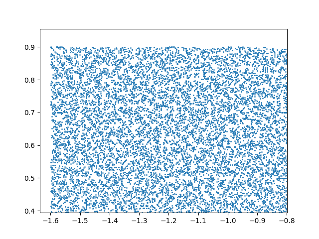
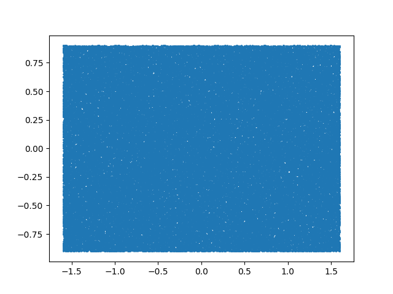
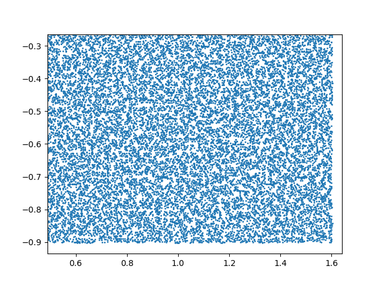

# FPGA Ray Tracer

A Simple Ray Tracing Engine implemented in hardware

## Project Organization

- [/software_model](./software_model/) contains the software ray tracer model this GPU design is based on.
- [/fpga_ray_tracer_hw](./fpga_ray_tracer_hw/) contains the SystemVerilog source files for the design and simulation sources

### Design log
- Started with figuring out what data types and arithmetic I'll need
  - floating point data type and arithmetic is vital. IEEE 754 32 bit floating point seems like a popular and straightfoward type. However, I'm not sure if the complexity is worth it. Let's go ahead with this for now, will contemplate later if optimization is necessary. Can look into separate data types for unit vectors and other vectors for efficiency later. Fixed point is probably a better idea.
  - Vivado provides ips for all kinds of floating point operations, how convenient! They use AXI Stream protocol.
  - On closer inspection, I cannot bear the amount of resources that floating point arithmetic will overall consume. Stuff like generating random floats and so on. Let's go head first into fixed point.
  - Going with Q18.14 fixed point for all arithmetic.
- Ideated the architecture on paper. A ray generator that'll generate rays and assign it to one of the ray tracing cores, with a pixel accumulator storing the color for the pixel and outputting it or saving it in memory.
  
<!-- - Decided to build the entire thing bottom-up, starting with rendering the background. -->
- Let's start by building the ray generator, which will generate a random ray within each pixel for each sample.
  - Implemented psuedo rng for generating random rays within each pixel.
  - Runs very ineffecicient (area-wise) logic for now, will change later if required.
  - Generates a random ray for each pixel for each sample at each clock cycle.
  - Plotted the output using matplotlib to confirm they're actually how I expect them to be (uniformly distributed with correct ranges). Seems alright.

  

    
     
    
  

- Now Working on the pixel accumulator that'll average out color values for each sample and convert it to 24 bit RGB format to be stored later 
  - Also implemented a fix3 to RGB module that converts color data in a fixed (ranged 0 to 1) to 24 bit RGB color for storage/display.
- Now let's implement a primitive ray core that just returns the background color and pixel accumulator and start working towards our first render!
  - Making a single core system for now, will worry about parallelization and pipelining later. 